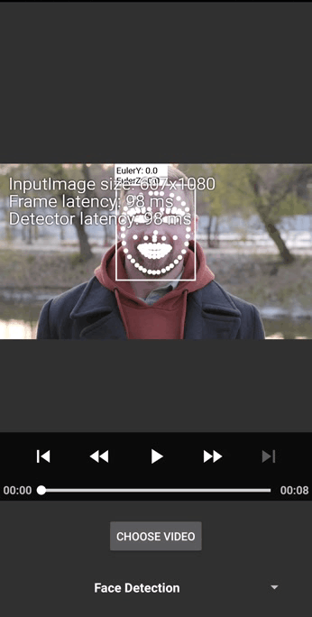
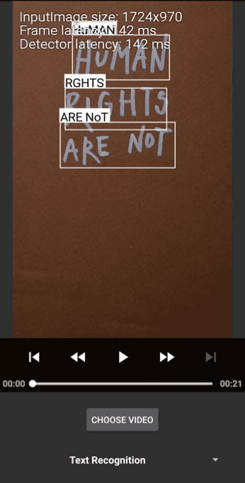

# Vigilante AI V3

**Vigilante AI V3** es una aplicación avanzada de visión artificial para Android diseñada para la seguridad y el monitoreo en tiempo real. Utiliza las potentes APIs de **Google ML Kit** para detectar objetos, rostros y poses con alta precisión.

Este proyecto es una evolución optimizada para ofrecer un rendimiento superior en la vigilancia mediante el uso de CameraX y procesamiento de video en tiempo real.

## Características principales
* **Detección en tiempo real:** Procesamiento de flujo de cámara en vivo utilizando CameraX.
* **Múltiples modos de visualización:** 
    * Modo Compatible (LivePreview)
    * Modo Alto Rendimiento (CameraX)
* **Detección avanzada:** Identificación de objetos, rostros y seguimiento de poses.
* **Soporte de video:** Capacidad para procesar cuadros de video pre-grabados utilizando ExoPlayer.

## Configuración y Uso
La actividad principal es `com.securepass.vision.kotlin.ChooserActivity`, la cual permite seleccionar entre los diferentes motores de detección disponibles.

## Tecnologías utilizadas
* **Kotlin:** Lenguaje principal de desarrollo.
* **ML Kit Vision API:** Motor de inteligencia artificial.
* **CameraX:** API de cámara moderna para Android.
* **ExoPlayer:** Para el procesamiento de video.

## Vistas previas
 

---
*Desarrollado por Secure Pass Vision - Versión 3.0*
